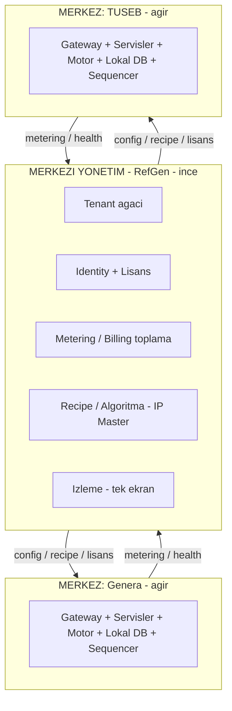
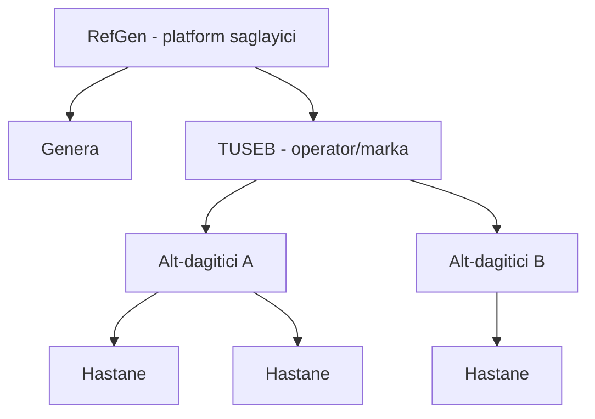
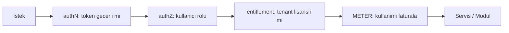
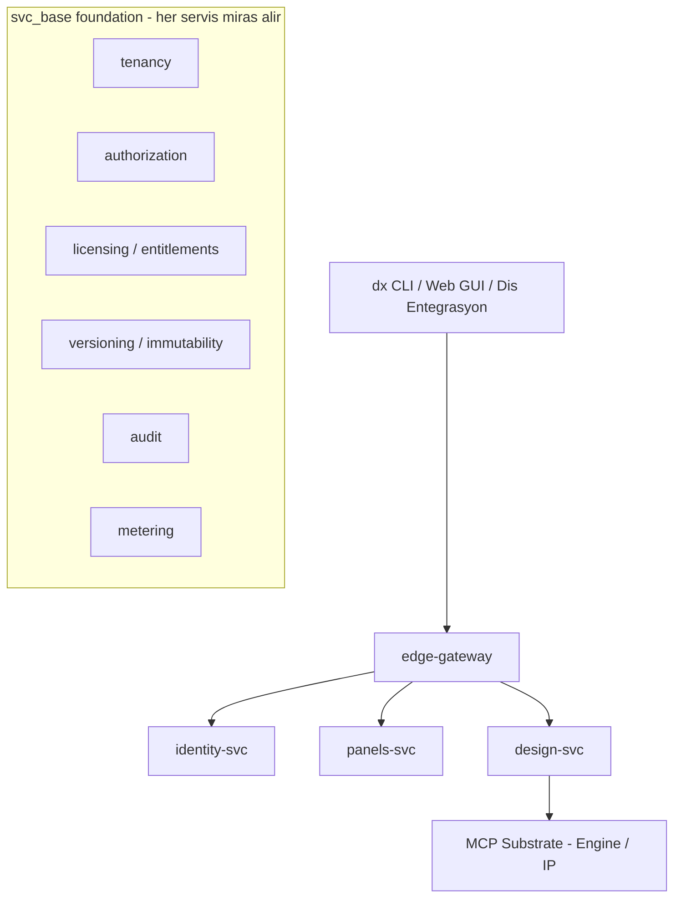
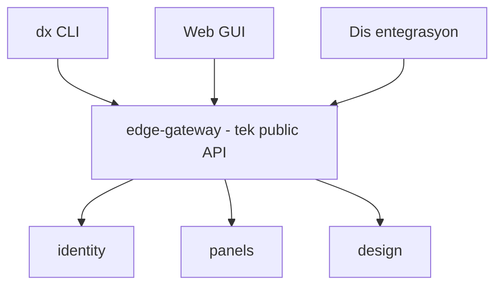

# RefGen Platformu — Mimari ve Vizyon Dokümanı

> **Proje:** dxm (RefGen mikroservis platformu)
> **Tarih:** 2026-06-17 · **Sürüm:** Taslak v0.1 · **Durum:** Tartışma/onay aşamasında
> **Dil notu:** Bu doküman Türkçe tutulmuştur; üzerinde birlikte çalışıp PDF'e dönüştürülecektir.

---

## 1. Özet

RefGen, **yeni nesil dizileme (NGS) kimyasal kitleri** geliştiren bir şirkettir. Bu kitlerin doğru kullanılabilmesi için **yazılım + biyoinformatik analiz** gerekir. RefGen bu yazılımı, kendisi ve iş ortakları (TÜSEB, Genera ve diğer merkezler) için **bir hizmet olarak (Software as a Service)** sunacaktır.

Kurmakta olduğumuz platform (**dxm**), şu üç şeyi aynı anda başaracak şekilde tasarlanmaktadır:

1. **Çok kiracılı (multi-tenant) bir hizmet** — tek altyapı, birçok müşteri/merkez, hiyerarşik dağıtıcı ağı.
2. **Fikri mülkiyeti (biyoinformatik) koruyan** bir yapı — analiz motoru RefGen'in kontrolünde kalır.
3. **Kullanıma göre lisanslanan ve faturalanan** bir iş modeli.

Bu hedeflere ulaşmak için **mikroservis mimarisi** ve **Docker** tabanlı, **merkezi yönetilen + dağıtık çalışan** bir yapı benimsenmiştir.

---

## 2. İş Bağlamı

- **RefGen** = NGS kimyasal kit üreticisi. **dxm** platformu, bu kitlerin panel tasarımı ve analizini yönetir.
- **TÜSEB anlaşması:** Kitler **TÜSEB'in kendi markasıyla** (white-label) üretilecek. Analiz yazılımını da RefGen, TÜSEB adına yapacak.
- **Çok katmanlı dağıtım:** TÜSEB kendi ürünlerini satan bir şirkettir; **alt-dağıtıcıları** olabilir; başka **hastanelere ve ülkelere** satabilir.
- **Tek altyapı, çok merkez:** Aynı platform **Genera** (RefGen'in laboratuvarı) ve diğer merkezlere de hizmet verecek. Yani TÜSEB özel bir iş değil — **genel bir platform ürünü**; TÜSEB ilk müşteri.
- **İş modeli:** **SaaS** — RefGen platformu bir hizmet olarak işletir; müşteriler satın aldıkları hizmet kapsamında lisanslanır ve kullanıma göre faturalanır.

### Roller (B2B2B / "powered by RefGen")

| Taraf | Rolü |
|---|---|
| **RefGen** | Altyapı + biyoinformatik IP sağlayıcısı; platformu işletir |
| **TÜSEB / operatörler** | Markalı operatör; kendi ortak ağını yönetir |
| **Alt-dağıtıcılar** | Operatörün altındaki ara satıcılar |
| **Hastaneler** | Uç kullanıcı; kendi panelleri ve klinik verisi |

---

## 3. Temel Tasarım Prensipleri

1. **Her şey Docker'da çalışır.** Host makineye kurulum yapılmaz.
2. **Yönetim merkezi, çalışma dağıtık.** İnce bir merkezi kontrol düzlemi; ağır iş (veri + analiz) dağıtık merkezlerde.
3. **Servis sınırı = IP sınırı.** Müşteriye giden katman ile RefGen'de kalan motor net ayrılır.
4. **Servis sınırı = modül sınırı.** Her ürün modülü kaba bir bounded-context servistir.
5. **Hiçbir yere müşteri adı yazılmaz.** Her şey tenant/merkez parametresi (`tenant_id`).
6. **Cross-cutting yapılar bir kez yazılır** (`svc_base` framework); her modül miras alır.
7. **Mevcut API kontratı korunur** — dx CLI ve mevcut istemciler bozulmaz (strangler-fig).
8. **Altın standart:** pinned bağımlılıklar, non-root container, healthcheck, yapılandırılmış loglama, audit, test, traceability.

---

## 4. Mimari Genel Bakış — İki Düzlem

Veritabanları ve biyoinformatik motor **dağıtık** olabilir; ancak **yönetim merkezidir.** Mimari bu nedenle iki düzleme ayrılır:

| Merkezi (ince — RefGen) | Dağıtık (ağır — her merkez) |
|---|---|
| Tenant ağacı, identity, lisans | Lokal DB (panel/run/klinik veri) |
| Metering toplama, faturalama | Biyoinformatik motor (MCP'ler) |
| Recipe/algoritma (IP) master + dağıtımı | Sequencer'larla yan yana |
| Tüm merkezlerin tek-ekran izlenmesi | Merkezden config/recipe çeker, yukarı metering yollar |

> **Not:** "Merkezi yönetim", işin/platformun **admin düzlemidir** (tenant, lisans, billing, IP, izleme). Container'ların başlat/durdur yönetimi ayrı bir konudur ve onu yerelde **Docker** yapar.

---

## 5. Çok Kiracılılık (Multi-tenancy)

Tenant yapısı **sabit katmanlı değil, keyfi derinlikte bir ağaçtır.** Tek bir alanla modellenir: **`parent_tenant_id`** (kendine referans).

**Sonuçları:**
- **Hiyerarşik yetki:** Her admin yalnızca kendi alt-ağacını yönetir.
- **Hiyerarşik faturalama:** Kullanım yukarı toplanır; her dağıtıcı seviyesi kendi fiyat/marjını koyabilir.
- **White-label kaskadı:** Marka her seviyede ayrı ayarlanır.

### ⚠️ Kritik kural (KVKK / klinik)

**Ticari hiyerarşi ≠ klinik veri erişimi.**
- Dağıtıcılar kendi alt-ağacının **kullanım/fatura özetlerini** görür.
- **Hasta/klinik verisini ASLA görmez** — o yalnızca uç hastanede kalır.

Para/yönetim yukarı akar; **klinik veri akmaz.**

---

## 6. Lisanslama ve Faturalama (SaaS)

İki kavram net ayrılır:
- **Lisans (entitlement):** Tenant'ın **kullanmaya izinli olduğu** servis/modül kapsamı + limitler. → satın alma kapsamı.
- **Faturalama:** Bu kapsam içinde **gerçekte kullanılan** (örn. analiz başına). → tüketim.

Her istek üç kapıdan geçer, sonra ölçülür:

| Kapı | Soru | Kaynak |
|---|---|---|
| **authZ (rol)** | bu *kullanıcı* ne yapabilir? | token'daki rol |
| **entitlement (lisans)** | bu *tenant* neyi satın aldı? | tenant lisansı |
| **metering** | ne kadar kullandı? | usage event → billing |

**Akış (merkezi yönetimle uyumlu):** Lisanslar **merkezde tanımlanır**, dağıtık servislere **itilir**, **yerelde uygulanır**, kullanım **yerelde ölçülür**, **merkezde faturalanır.**

---

## 7. Fikri Mülkiyet (IP) Koruması

RefGen'in asıl uzmanlığı/IP'si **biyoinformatiktir** (analiz algoritmaları, tasarım mantığı, recipe'ler). Bu bilgi müşteriyle paylaşılmaz.

- **Müşteriye giden katman (shippable):** gateway, identity, panels (panel yönetimi), GUI, kit iş akışı. Müşteri panelini yönetir, **sonucu görür.**
- **RefGen'de kalan katman (protected):** design-svc analiz mantığı + **recipe'ler (ADR-0005)** + **MCP substrate (asıl algoritmalar)**. Müşteri API'den **istek atar, sonucu alır, içini görmez.**

**Motor dağıtık çalışabilir** (başka merkezlerde). Bu durumda kontrol noktası fiziksel merkez değil, **metering + lisans**'tır:
- Her motor instance'ı bir **tenant/merkez kimliği + lisans** taşır,
- **kim ne kadar kullandı** ölçer, **merkezi toplayıcıya** raporlar,
- **güvenilir** (store-and-forward — offline kullanım kaybolmaz) ve **kurcalanamaz** (imzalı kayıt) olmalıdır,
- on-prem zorunluysa: **mühürlü/obfuscated container + lisans anahtarı**, asla kaynak kod.

Aynı usage-event hem **fatura satırı** hem **kullanım kanıtı** hem **audit** kaydıdır.

---

## 8. Ürün Modülleri

Platform fonksiyonel modüllerden oluşur; her modül kaba bir servistir.

| Modül | Ne yapar | Katman | Konum | Faturalama |
|---|---|---|---|---|
| **Design** *(şimdi)* | panel / probe / bait tasarımı | control plane | merkezi/tenant | — |
| **Development** *(şimdi)* | kit geliştirme / validasyon | control plane | çoğunlukla RefGen-içi | — |
| **Analysis** *(gelecek)* | dizileme çıktısı → varyant → klinik rapor | **engine (IP)** | dağıtık, metered | ✅ **per-analysis tetikleyici** |
| **Run control** *(gelecek)* | run / sample / QC yönetimi (LIMS-benzeri) | operasyonel | **edge** (sequencer yanında) | besler → Analysis |

Yeni modül = yeni servis; gateway'e takılır, mevcut işi bozmaz.

---

## 9. Mikroservis Yapısı

### Neden mikroservis (gerekçe)

Bugünkü ölçek tek başına gerektirmez; ancak **gidilen yer** gerektirir. Asıl gerekçe **bileşenlerin farklı yaşam döngüsü/sahipliği/konumu** olmasıdır:

| Bileşen | Sahibi | Konum | Değişim hızı |
|---|---|---|---|
| Biyoinformatik motor | RefGen (IP) | dağıtık | sık |
| Control plane | müşteriye gider (white-label) | her merkez | orta |
| Veri (DB) | uç tenant | lokal | sürekli |
| Merkezi yönetim + billing | RefGen | merkez | yavaş |

Bunlar bir monolith'e sığmaz; sonradan sökmek pahalıdır. **Uyarı:** Granülerlik **kaba** tutulur — bir avuç iyi-sınırlı servis, düzinelerce minik servis değil.

### Servisler ve foundation

**`svc_base` foundation (6 yetenek + mevcut altyapı):**

| Foundation | İçerik |
|---|---|
| **tenancy** | `tenant_id` + `parent_tenant_id` mixin; subtree-scoping |
| **authorization** | roller token'da + kaynak/tenant sahiplik + ağaç-subtree yetkisi |
| **licensing / entitlements** | tenant'ın izinli servis/modül kapsamı + limit kontrolü |
| **versioning / immutability** | deterministik `content_hash` + değişmez version + lock guard |
| **audit** | append-only, her state değişimini yazar |
| **metering** | billable aksiyonda usage-event (outbox, kayıpsız) |
| *(mevcut)* | identity/JWT, hata şekli, loglama+request-id, DB helper, config, health |

---

## 10. API ve İstemciler

API kaybolmaz; servislere bölünüp **gateway'de tek tutarlı yüzeyde** birleşir.

- **Kontrat korunur:** gateway, dx'in bugün konuştuğu API şekillerini aynen sunar → mevcut istemciler bozulmaz. **dx'in `api.py`'si = kontrat spec'i.**
- **API versiyonlama:** `/api/v1` ile; servisler içeride evrilir, kontrat sabit kaldıkça istemci bozulmaz.
- **OpenAPI:** Her servis otomatik OpenAPI yayınlar → tipli istemci üretimi (dx, web GUI).

> Mevcut platformda zaten canlı bir REST API (61 endpoint, OpenAPI/Swagger) ve `:5174`'te bir web frontend mevcuttur; bunlar yeni yapının istemcileri olur.

---

## 11. MCP Substrate (Motor)

Mevcut **18 MCP sunucusu** zaten mikroservistir (bağımsız container, HTTP, internal-only). **Yeniden yazılmaz — olduğu gibi kullanılır** ve **biyoinformatik motoru = MCP substrate**'tir. Yalnızca `design-svc` MCP'lerle konuşur; müşteri MCP'lere doğrudan erişemez (doğal IP duvarı).

Yeni MCP eklenirken mevcut `platform/_base` deseni izlenir; bağımlılıklar **pinlenir** (rebuild kırılganlığı notu).

---

## 12. Dağıtım Topolojisi

- **1. adım:** Sequencer'lar **tek merkezde**; o merkezdeki **on-prem server'larda** yazılım + **lokal veritabanı** çalışır (veri yerçekimi — terabaytlarca ham veri yerinde işlenir).
- **İlk somut hedef:** Kendi içinde tam, **kurulabilir bir Docker stack** (gateway + servisler + Postgres + motor) — bu, **`refgen-core`**'dur.
- **Genelleme:** Aynı stack her merkeze kurulur; her biri merkezi yönetime bağlanır (identity/lisans/metering/recipe).

**Açık soru (IP yaklaşımını etkiler):** Merkez **RefGen/TÜSEB tarafından mı işletiliyor** (IP doğal korunur) yoksa **müşteri sahasında mı** (mühürlü/lisanslı container gerekir)?

---

## 13. Veri ve Versiyonlama

- **Her servis kendi veritabanına sahiptir** (paylaşılan DB yok). Pratikte: tek Postgres container içinde ayrı database'ler; ileride ayrı sunuculara taşınabilir.
- **Servisler DB'ye doğrudan (ORM) bağlanır**, MCP üzerinden değil — gerçek transaction, tip güvenliği, migration için.
- **Versiyonlama her servis kendi aggregate'i için yapar.** Panel bütünü (panel + gen + version + region + üye) `panels-svc`'de **tek transaction'da** kalır → kilit/snapshot **atomik**; immutability korunur.
- **Çapraz-servis referans:** `{panel_id, version, content_hash}` — ortak DB olmadan doğrulanabilir tekrar-üretilebilirlik.

---

## 14. Güvenlik ve Uyum

- **Kimlik/yetki:** JWT; merkezi üretim (identity), her serviste yerel doğrulama. **Hedef: RS256/EdDSA** (yalnızca identity üretebilir; diğerleri yalnızca doğrular) — dev'de HS256.
- **KVKK / GDPR:** Veri yerinde kalır (residency); klinik veri uç tenant'ta; ticari hiyerarşi klinik veriyi görmez.
- **Audit:** Append-only, her kritik işlem kaydedilir (KVKK + finansal iz).
- **Regülasyon:** Yurtdışı klinik yazılım CE-IVD / FDA / yerel onay gerektirebilir → traceability ve validasyon "teslim edilebilir" kalitede.

---

## 15. Yol Haritası

**Yöntem:** Define → Plan → Build → Verify → Record → Gate. Modül modül, her adımda **kullanıcı onayı (gate)** ile.

| Aşama | İçerik | Durum |
|---|---|---|
| **0. Barebone framework** | `svc_base` + servis template + Docker temeli | ✅ kuruldu, test edildi |
| **0b. Foundation** | tenancy · authorization · licensing · versioning · audit · metering | sırada |
| **1. Control plane** | edge-gateway · identity-svc · panels-svc (Design) · Postgres | planlı |
| **2. Engine bağlama** | design-svc → MCP substrate (gerçek motor) | planlı |
| **3. Merkezi yönetim** | tenant ağacı · lisans · metering toplama | planlı |
| **4. Billing** | usage → fatura | planlı |
| **5. Yeni modüller** | Analysis · Run control | gelecek |

---

## 16. Açık Sorular

1. Merkez RefGen/TÜSEB-işletilen mi, müşteri sahası mı? (IP yaklaşımı)
2. Çok dil (i18n) gerekecek mi? ("dx UI hep İngilizce" kuralıyla gerilim)
3. TÜSEB için ayrı markalı instance mı, tek-platform multi-tenant mı (yoksa ikisi birden mi)?
4. Lisans/fiyat modeli ayrıntıları (per-analysis fiyatı, abonelik tabanı, dağıtıcı marjları)?

---

## 17. Sözlük

| Terim | Anlamı |
|---|---|
| **dxm** | RefGen mikroservis platformu (bu proje) |
| **Tenant** | Bir kiracı (operatör, dağıtıcı veya hastane) |
| **Control plane** | Müşteriye giden, jenerik yönetim katmanı |
| **Engine / Motor** | Biyoinformatik analiz katmanı (MCP substrate) = IP |
| **Entitlement** | Bir tenant'ın kullanmaya izinli olduğu kapsam (lisans) |
| **Metering** | Kullanımın ölçülmesi (→ fatura + kanıt) |
| **Recipe** | Versiyonlu çalıştırma yöntemi (analiz/tasarım know-how'ı) |
| **MCP** | Model Context Protocol sunucusu (motor bileşeni) |
| **SaaS** | Hizmet olarak yazılım (Software as a Service) |

---

*Bu doküman birikmiş tasarım kararlarının referansıdır. Üzerinde çalışılıp olgunlaştıkça sürüm numarası güncellenir ve PDF'e dönüştürülür.*
